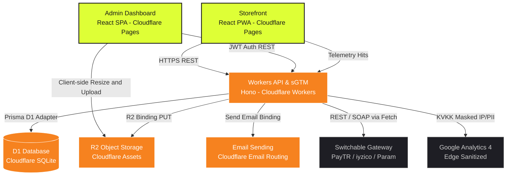

# ⚡ E-Market: Serverless E-Commerce Platform on Cloudflare

E-Market is a modern, high-performance, fully serverless e-commerce framework designed to deploy and run entirely within the **Cloudflare Ecosystem**. 

Unlike traditional monoliths or containerized setups, E-Market leverages lightweight V8 isolates (**Cloudflare Workers**), serverless SQL databases (**Cloudflare D1**), free-egress object storage (**Cloudflare R2**), and lightning-fast CDNs (**Cloudflare Pages**) to deliver sub-millisecond response times, absolute privacy compliance, and near-zero running costs.

This project is open-source, fully responsive, and works as a Progressive Web App (PWA) out-of-the-box.

---

## 📐 System Architecture

Below is the serverless architecture diagram showing how the client storefront, admin dashboard, Hono API, databases, telemetry proxies, and third-party integrations interact:



---

## 🛠️ Core Technology Stack

| Component | Technology | Description |
| :--- | :--- | :--- |
| **Storefront** | React, Vite, PWA, Tailwind CSS | Fully responsive storefront, SEO-optimized, with PWA offline-capability and multilingual support. |
| **Admin Panel** | React, Vite, CSS, Lucide | Premium, light/dark mode switchable dashboard with interactive charts and direct R2 image uploads. |
| **API Backend** | Hono Framework | Ultra-fast REST API designed for V8 isolates, providing zero cold start. |
| **Database** | Cloudflare D1 & Prisma ORM | Serverless SQL database using Prisma with `@prisma/adapter-d1`. |
| **Asset Storage** | Cloudflare R2 | S3-compatible object storage for product images with zero egress fees. |
| **Edge Telemetry** | Server-Side GTM & KVKK Filter | Proxy-loads GTM scripts and routes GA4 analytics events through Worker middleware to mask IPs and scrub PII. |
| **Gateways** | PayTR / iyzico / Param | Decoupled payment provider interface switchable via a single configuration. |

---

## 📁 Repository Structure

```text
e-commerce-cloudflare/
├── client/              # React Storefront (Cloudflare Pages)
├── admin/               # React Admin Dashboard (Cloudflare Pages)
├── api/                 # Hono REST API Worker (Cloudflare Workers)
│   ├── prisma/          # Prisma SQLite migrations and seed scripts
│   └── src/             # API Controllers, Repositories, Middlewares, and Services
├── scripts/             # Utility deploy & execution scripts
├── .github/             # CI/CD Workflows, Dependabot, and Issue Templates
└── package.json         # Monorepo management scripts
```

---

## 🚀 Local Development Quickstart

### Prerequisites
- [Node.js](https://nodejs.org/) (v20 or higher recommended)
- [NPM](https://www.npmjs.com/)
- Cloudflare Wrangler CLI (installed automatically)

### 1. Install Dependencies
Install all node modules recursively across the monorepo:
```bash
npm run install:all
```

### 2. Set Up Local SQLite Database
Run D1 migrations locally using Wrangler and Prisma generate:
```bash
# Generate Prisma Client
npm run dev:api -- npx prisma generate

# Apply migrations to local D1 instance
npm run db:migrate
```

### 3. Seed Database
Seed initial system configurations and dummy products into your local database:
```bash
npm run db:seed
```

### 4. Start Development Servers
Run all applications (Storefront, Admin, and Workers API) concurrently:
```bash
npm run dev
```

Your local endpoints will be available at:
- **Workers API:** `http://localhost:8787`
- **Storefront storefront:** `http://localhost:5173`
- **Admin Panel:** `http://localhost:5174`

---

## 🌐 Deployed Live Endpoints

The applications are built, tested, and deployed to Cloudflare via the automated CI/CD pipeline:

- **Storefront (Pages):** [https://ecommerce-storefront-dm5.pages.dev](https://ecommerce-storefront-dm5.pages.dev)
- **Admin Panel (Pages):** [https://ecommerce-admin-v4s.pages.dev](https://ecommerce-admin-v4s.pages.dev)
- **Production API Worker:** [https://e-commerce-cloudflare.yusuftalhaarabaci-91d.workers.dev](https://e-commerce-cloudflare.yusuftalhaarabaci-91d.workers.dev)
- **Staging API Worker:** [https://e-commerce-cloudflare-staging.yusuftalhaarabaci-91d.workers.dev](https://e-commerce-cloudflare-staging.yusuftalhaarabaci-91d.workers.dev)

### 🔑 Default Admin Dashboard Credentials
Use the following credentials to access the live or local Admin Dashboard:
- **Email:** `admin@e-market.com`
- **Password:** `admin12345`

---

## 💳 Payment Gateway Configurations

E-Market includes built-in, ready-to-use integrations for Turkey's leading payment gateways. To select a provider, set the `PAYMENT_PROVIDER` environment variable in your `api/.env` file:

```env
# Switchable options: param, iyzico, paytr
PAYMENT_PROVIDER=param

# Param POS Gateway Configuration:
PARAM_CLIENT_CODE=your-code
PARAM_CLIENT_USERNAME=your-username
PARAM_CLIENT_PASSWORD=your-password
PARAM_GUID=your-guid

# iyzico Configuration:
IYZICO_API_KEY=your-api-key
IYZICO_SECRET_KEY=your-secret-key
IYZICO_BASE_URL=https://sandbox-api.iyzipay.com

# PayTR Configuration:
PAYTR_MERCHANT_ID=your-merchant-id
PAYTR_MERCHANT_KEY=your-merchant-key
PAYTR_MERCHANT_SALT=your-merchant-salt
PAYTR_BASE_URL=https://www.paytr.com
```

---

## 🛡️ Edge Telemetry & KVKK Compliance

E-Market enforces data privacy natively at the edge. 

- **Proxy Routing:** Client-side telemetry is loaded from `/api/v1/metrics/gtm.js` and events are sent to `/api/v1/metrics/collect`.
- **IP Masking:** Client IP address octets are masked (e.g. `192.168.1.123` -> `192.168.1.0`) before forwarding to analytics endpoints.
- **PII Scrubbing:** Emails and phone number formats are scrubbed out of payloads via regex scanning at the edge.

---

## 💾 Automated Database Backups to Google Drive

E-Market includes a nightly automated backup pipeline (`.github/workflows/backup.yml`) that exports your remote production D1 SQL database content, compresses it (`gzip`), and encrypts it symmetrically using `GPG` for maximum security. The encrypted file is uploaded directly to a Google Drive folder using a native Node.js upload utility (`scripts/uploadToDrive.js`) without external npm library dependencies.

### Configuration
To configure the backup pipeline, add the following Repository Secrets to your GitHub repository:
- `CLOUDFLARE_API_TOKEN`: A Cloudflare token with edit permissions for your D1 Database.
- `CLOUDFLARE_ACCOUNT_ID`: Your Cloudflare Account ID.
- `BACKUP_ENCRYPTION_PASSPHRASE`: A strong passphrase used to encrypt your backup file symmetrically using GPG.
- `GDRIVE_SERVICE_ACCOUNT`: The full JSON key contents of your Google Cloud Service Account.
- `GDRIVE_FOLDER_ID`: (Optional) The folder ID of your target Google Drive folder.

*Note: Remember to share the target Google Drive backup folder with your service account email address (with Editor role) to grant permission.*

---

## 🚦 Branch Protection & CI/CD Checks

To guarantee code quality and stability in open-source environments, E-Market runs automated checks on every pull request targeting `test` or `main` branches:
- **Dependency Audit:** Immutability checking with `npm ci`.
- **Database Schema Validation:** Validates model structure consistency using `npx prisma validate`.
- **Code Linter Verification:** Code quality checks on the client storefront and admin panels.
- **SAST Security Scanning:** Automated vulnerability checks using Semgrep.

These checks must pass successfully before a pull request can be merged. Deployments to staging or production are strictly reserved for post-merge pushes to the `test` or `main` branches respectively.

---

## ☁️ Deploying to Cloudflare

### Automatic Deployment (Recommended)
You can deploy the entire stack (D1 database, R2 bucket, Hono API Worker, Storefront Pages, and Admin Pages) with a single interactive script:
```bash
npm run deploy
```
The wizard will check your authentication, guide you through creating cloud resources, set up D1 bindings, build, and deploy all components.

### Manual Deployment Steps

#### 1. D1 Database Creation
Create your production D1 Database in Cloudflare:
```bash
npx wrangler d1 create ecommerce-d1
```
Copy the outputted `database_id` and paste it inside `api/wrangler.toml`:
```toml
[[d1_databases]]
binding = "DB"
database_name = "ecommerce-d1"
database_id = "YOUR_CLOUDFLARE_D1_DATABASE_UUID"
```
Apply migrations to production D1:
```bash
npx wrangler d1 migrations apply ecommerce-d1 --remote --cwd api
```

#### 2. R2 Storage Bucket Creation
Create an R2 Bucket for product assets:
```bash
npx wrangler r2 bucket create ecommerce-r2
```

#### 3. Deploy API Worker
Deploy the Workers API using wrangler:
```bash
cd api
npx wrangler deploy
```

#### 4. Configure Redirects and Deploy Frontends to Cloudflare Pages
Create a `_redirects` file in `client/public/_redirects` and `admin/public/_redirects` pointing to your deployed API URL to avoid CORS:
```text
/api/* https://your-workers-api-url.workers.dev/api/:splat 200
```
Build and deploy `client/dist` and `admin/dist` directly as Cloudflare Pages projects:
```bash
# Build Client & Admin
npm run build --prefix client
npm run build --prefix admin

# Deploy to Staging (Preview)
npx wrangler pages deploy client/dist --project-name e-market-client --branch test
npx wrangler pages deploy admin/dist --project-name e-market-admin --branch test

# Deploy to Production (Live)
npx wrangler pages deploy client/dist --project-name e-market-client --branch main
npx wrangler pages deploy admin/dist --project-name e-market-admin --branch main
```

---

## 🤝 Contributing

We welcome contributions to E-Market! Please refer to our [Contributing Guidelines](CONTRIBUTING.md) and [Code of Conduct](CODE_OF_CONDUCT.md) for standards.

---

## 📄 License

This project is licensed under the MIT License. See `LICENSE` for more information.
