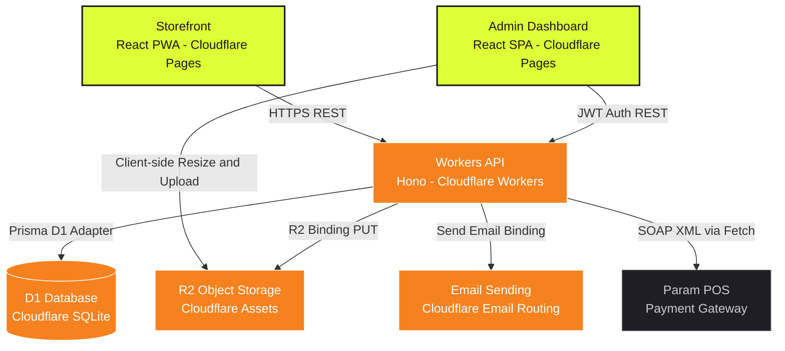

# ⚡ E-Market: Serverless E-Commerce Platform on Cloudflare

E-Market is a modern, high-performance, fully serverless e-commerce platform designed from the ground up to deploy and run entirely within the **Cloudflare Ecosystem**. 

Unlike traditional monoliths or containerized setups, E-Market leverages lightweight V8 isolates (Cloudflare Workers), serverless SQL databases (Cloudflare D1), free-egress object storage (Cloudflare R2), and lightning-fast CDNs (Cloudflare Pages) to deliver sub-millisecond response times, absolute security, and near-zero running costs.

This project is open-source, fully responsive, and works as a Progressive Web App (PWA) out-of-the-box.

---

## 📐 System Architecture

Below is the serverless architecture diagram showing how the client storefront, admin dashboard, server API, databases, and third-party integrations interact:



---

## 🛠️ Core Technology Stack

| Component | Technology | Description |
| :--- | :--- | :--- |
| **Storefront** | React, Vite, PWA, Tailwind CSS | Fully responsive storefront, SEO-optimized, with PWA offline-capability and multilingual support. |
| **Admin Panel** | React, Vite, CSS, Lucide | Premium, dark-mode dashboard with interactive charts, Canvas-based client-side image compression, and direct uploads. |
| **API Backend** | Hono Framework | Ultra-fast REST API designed for V8 isolates, providing zero cold start. |
| **Database** | Cloudflare D1 & Prisma ORM | Serverless SQL database using Prisma with `@prisma/adapter-d1`. |
| **Asset Storage** | Cloudflare R2 | S3-compatible object storage for product images with zero egress fees. |
| **Integrations** | Cloudflare Email & Web Crypto | Native Workers Email Sending (send_email) & Param POS Gateway (3D secure payments). |

---

## 📁 Repository Structure

```text
e-commerce-cloudflare/
├── client/              # React Storefront (Pages)
├── admin/               # React Admin Dashboard (Pages)
├── server/
│   └── api/             # Hono REST API Worker (Workers)
│       ├── prisma/      # Prisma SQLite migrations and seed scripts
│       └── src/         # API Controllers, Repositories, and Services
├── scripts/             # Utility extraction scripts
└── package.json         # Monorepo management scripts
```

---

## 🚀 Local Development Quickstart

### Prerequisites
- [Node.js](https://nodejs.org/) (v18 or higher recommended)
- [NPM](https://www.npmjs.com/) (bundled with Node.js)
- Cloudflare Wrangler CLI (installed automatically via devDependencies)

### 1. Install Dependencies
Install all node modules recursively across the monorepo root, client, admin, and server/api directories:
```bash
npm run install:all
```

### 2. Set Up Local SQLite Database
Run D1 migrations locally using Wrangler and Prisma generate:
```bash
# Generate Prisma Client
npm run dev:api -- npx prisma generate

# Apply migrations to local D1 instance
npm run db:migrate
```

### 3. Seed Database
Seed initial system configurations and dummy products into your local database:
```bash
npm run db:seed
```

### 4. Start Development Servers
Run all applications (Storefront, Admin, and Workers API) concurrently:
```bash
npm run dev
```

Your local endpoints will be available at:
- **Workers API:** `http://localhost:8787`
- **Storefront:** `http://localhost:5173` (configured locally)
- **Admin Panel:** `http://localhost:5174` (configured locally)

---

## ⚙️ Environment Configuration

### Workers API Environment Variables
Create a `.env` file inside `server/api/` based on `server/api/.env.example`:

- `ADMIN_JWT_SECRET`: Secret key used for signing administrator session tokens.
- `SMTP_SENDER`: Email sender header format (e.g., `E-Market <siparis@e-market-domain.com>`). Note that this sender email must be verified on your Cloudflare account.
- `PARAM_CLIENT_CODE`, `PARAM_CLIENT_USERNAME`, `PARAM_CLIENT_PASSWORD`, `PARAM_GUID`: Parameters for the Param POS Gateway interface.

---

## ☁️ Deploying to Cloudflare

### Automatic Deployment (Recommended)
You can deploy the entire stack (D1 database, R2 bucket, Hono API Worker, Storefront Pages, and Admin Pages) with a single interactive script:
```bash
npm run deploy
```
The wizard will automatically check your authentication, guide you through creating cloud resources, update configuration files, set up proxy redirects, build, and deploy all components.

---

### Manual Deployment Steps (Alternative)

#### 1. D1 Database Creation
Create your production D1 Database in Cloudflare:
```bash
npx wrangler d1 create ecommerce-d1
```
Copy the outputted `database_id` and paste it inside `server/api/wrangler.toml`:
```toml
[[d1_databases]]
binding = "DB"
database_name = "ecommerce-d1"
database_id = "YOUR_CLOUDFLARE_D1_DATABASE_UUID"
```

Apply migrations to production D1:
```bash
npx wrangler d1 migrations apply ecommerce-d1 --remote
```

#### 2. R2 Storage Bucket Creation
Create an R2 Bucket for product assets:
```bash
npx wrangler r2 bucket create ecommerce-r2
```

#### 3. Deploy API Worker
Deploy the Workers API using wrangler:
```bash
cd server/api
npx wrangler deploy
```

#### 4. Configure Redirects and Deploy Frontends to Cloudflare Pages
Create a `_redirects` file in `client/public/_redirects` and `admin/public/_redirects` pointing to your deployed API URL to avoid CORS:
```text
/api/* https://your-workers-api-url.workers.dev/api/:splat 200
```

Build and deploy `client/dist` and `admin/dist` directly as Cloudflare Pages projects:
```bash
# Build Client & Admin
npm run build --prefix client
npm run build --prefix admin

# Deploy Client
npx wrangler pages deploy client/dist --project-name e-market-client

# Deploy Admin
npx wrangler pages deploy admin/dist --project-name e-market-admin
```

---

## 🤝 Contributing

We welcome contributions to E-Market! Feel free to:
1. Fork the Repository.
2. Create your Feature Branch (`git checkout -b feature/AmazingFeature`).
3. Commit your changes (`git commit -m 'Add some AmazingFeature'`).
4. Push to the Branch (`git push origin feature/AmazingFeature`).
5. Open a Pull Request.

---

## 📄 License

This project is licensed under the MIT License. See `LICENSE` for more information.
