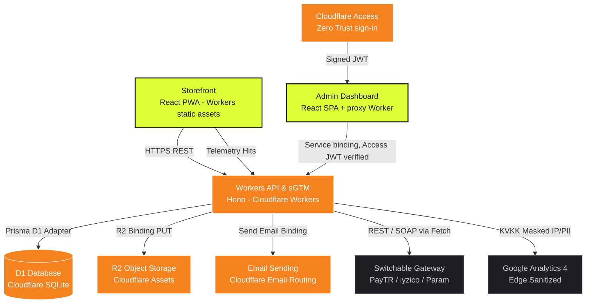

# ⚡ E-Market: Serverless E-Commerce Platform on Cloudflare

E-Market is a modern, high-performance, fully serverless e-commerce framework designed to deploy and run entirely within the **Cloudflare Ecosystem**. 

Unlike traditional monoliths or containerized setups, E-Market leverages lightweight V8 isolates (**Cloudflare Workers**), serverless SQL databases (**Cloudflare D1**), free-egress object storage (**Cloudflare R2**), and static assets served from Workers at the edge to deliver sub-millisecond response times, absolute privacy compliance, and near-zero running costs.

This project is open-source, fully responsive, and works as a Progressive Web App (PWA) out-of-the-box.

---

## 📐 System Architecture

Below is the serverless architecture diagram showing how the client storefront, admin dashboard, Hono API, databases, telemetry proxies, and third-party integrations interact:


```mermaid
graph TD
    classDef cfPages fill:#deff36,stroke:#191919,stroke-width:2px,color:#191919
    classDef cfWorkers fill:#f6821f,stroke:#fff,stroke-width:1px,color:#fff
    classDef external fill:#1e1e24,stroke:#555,stroke-width:1px,color:#ccc

    Storefront["Storefront\nReact PWA - Workers static assets"]:::cfPages
    Access["Cloudflare Access\nZero Trust sign-in"]:::cfWorkers
    Admin["Admin Dashboard\nReact SPA + proxy Worker"]:::cfPages
    API["Workers API & sGTM\nHono - Cloudflare Workers"]:::cfWorkers
    D1[("D1 Database\nCloudflare SQLite")]:::cfWorkers
    R2["R2 Object Storage\nCloudflare Assets"]:::cfWorkers
    Email["Email Sending\nCloudflare Email Routing"]:::cfWorkers
    Gateways["Switchable Gateway\nPayTR / iyzico / Param"]:::external
    GA4["Google Analytics 4\nEdge Sanitized"]:::external

    Storefront -->|HTTPS REST| API
    Access -->|Signed JWT| Admin
    Admin -->|Service binding, Access JWT verified| API
    API -->|Prisma D1 Adapter| D1
    API -->|R2 Binding PUT| R2
    API -->|Send Email Binding| Email
    API -->|REST / SOAP via Fetch| Gateways
    Storefront -->|Telemetry Hits| API
    API -->|KVKK Masked IP/PII| GA4
```

---

## 🛠️ Core Technology Stack

| Component | Technology | Description |
| :--- | :--- | :--- |
| **Storefront** | React, Vite, PWA, Tailwind CSS | Fully responsive storefront, SEO-optimized, with PWA offline-capability and multilingual support. |
| **Admin Panel** | React, Vite, CSS, Lucide | Premium, light/dark mode switchable dashboard with interactive charts and direct R2 image uploads. |
| **API Backend** | Hono Framework | Ultra-fast REST API designed for V8 isolates, providing zero cold start. |
| **Database** | Cloudflare D1 & Prisma ORM | Serverless SQL database using Prisma with `@prisma/adapter-d1`. |
| **Asset Storage** | Cloudflare R2 | S3-compatible object storage for product images with zero egress fees. |
| **Edge Telemetry** | Server-Side GTM & KVKK Filter | Proxy-loads GTM scripts and routes GA4 analytics events through Worker middleware to mask IPs and scrub PII. |
| **Gateways** | PayTR / iyzico / Param | Decoupled payment provider interface switchable via a single configuration. |

---

## 📁 Repository Structure

```text
e-commerce-cloudflare/
├── client/              # React Storefront (Workers static assets)
├── admin/               # React Admin Dashboard + proxy Worker (behind Cloudflare Access)
├── api/                 # Hono REST API Worker (Cloudflare Workers)
│   ├── prisma/          # Prisma SQLite migrations and seed scripts
│   └── src/             # API Controllers, Repositories, Middlewares, and Services
├── research/            # Academic study: serverless SAST corpus, protocol, analysis
├── scripts/             # Backup upload utility
├── .github/             # CI/CD Workflows, Dependabot, and Issue Templates
└── package.json         # Monorepo management scripts
```

---

## 🚀 Local Development Quickstart

### Prerequisites
- [Node.js](https://nodejs.org/) 22 or higher (required by Wrangler 4)
- [NPM](https://www.npmjs.com/)
- Cloudflare Wrangler CLI (installed automatically)

### 1. Install Dependencies
Install all node modules recursively across the monorepo:
```bash
npm run install:all
```

### 2. Set Up Local SQLite Database
Run D1 migrations locally using Wrangler and Prisma generate:
```bash
# Generate Prisma Client
npm run dev:api -- npx prisma generate

# Apply migrations to local D1 instance
npm run db:migrate
```

### 3. Seed Database
Seed initial system configurations and dummy products into your local database:
```bash
npm run db:seed
```

### 4. Start Development Servers
Run all applications (Storefront, Admin, and Workers API) concurrently:
```bash
npm run dev
```

Your local endpoints will be available at:
- **Workers API:** `http://localhost:8787`
- **Storefront:** `http://localhost:3000`
- **Admin Panel:** `http://localhost:5173`

Admin API routes are protected by Cloudflare Access and return `503` locally
unless `ACCESS_TEAM_DOMAIN` / `ACCESS_AUD` are set (see `api/.dev.vars.example`).

---

## 🌐 Environments

Deployed by the CI/CD pipeline after all security gates pass:

| | Staging (`staging` branch) | Production (`production` branch) |
| --- | --- | --- |
| Storefront | [staging.ecommerceflaredev.web.tr](https://staging.ecommerceflaredev.web.tr) | [ecommerceflaredev.web.tr](https://ecommerceflaredev.web.tr) |
| Admin Panel | [staging-admin.ecommerceflaredev.web.tr](https://staging-admin.ecommerceflaredev.web.tr) | [admin.ecommerceflaredev.web.tr](https://admin.ecommerceflaredev.web.tr) |
| API | [staging-api.ecommerceflaredev.web.tr](https://staging-api.ecommerceflaredev.web.tr/api/v1/health) | [api.ecommerceflaredev.web.tr](https://api.ecommerceflaredev.web.tr/api/v1/health) |

### 🔐 Admin access
The admin panel has no username/password. Sign-in is handled by **Cloudflare
Access** (one-time PIN to an allowed e-mail address); the API verifies the
signed Access token on every admin request. Access is granted by the
repository owner.

---

## 💳 Payment Gateway Configurations

E-Market includes built-in, ready-to-use integrations for Turkey's leading payment gateways. To select a provider, set the `PAYMENT_PROVIDER` environment variable in your `api/.env` file:

```env
# Switchable options: param, iyzico, paytr
PAYMENT_PROVIDER=param

# Param POS Gateway Configuration:
PARAM_CLIENT_CODE=your-code
PARAM_CLIENT_USERNAME=your-username
PARAM_CLIENT_PASSWORD=your-password
PARAM_GUID=your-guid

# iyzico Configuration:
IYZICO_API_KEY=your-api-key
IYZICO_SECRET_KEY=your-secret-key
IYZICO_BASE_URL=https://sandbox-api.iyzipay.com

# PayTR Configuration:
PAYTR_MERCHANT_ID=your-merchant-id
PAYTR_MERCHANT_KEY=your-merchant-key
PAYTR_MERCHANT_SALT=your-merchant-salt
PAYTR_BASE_URL=https://www.paytr.com
```

---

## 🧪 Test Kartları (Staging Ortamı)

Staging ortamında ödeme testi yapmak için kullanabileceğiniz kart numaraları:

### ✅ Başarılı Ödeme Kartları
| Kart Numarası | Banka / Açıklama |
|:---|:---|
| `5526 0800 0000 0006` | Akbank (Kredi Kartı) |
| `5890 0400 0000 0016` | Akbank (Banka Kartı) |
| `4543 5900 0000 0006` | İş Bankası (Kredi Kartı) |
| `6501 7001 9414 7183` | Vakıfbank (Troy Kredi) |
| `5451 0300 0000 0000` | Yapı Kredi (Kredi Kartı) |

### ✗ Hata Simülasyon Kartları
| Kart Numarası | Hata |
|:---|:---|
| `4111 1111 1111 1129` | Yetersiz Bakiye |
| `4125 1111 1111 1115` | Süresi Geçmiş Kart |
| `4124 1111 1111 1116` | Geçersiz CVC |
| `4151 1111 1111 1112` | 3D Secure Başlatma Hatası |

**Tüm kartlar için:** Son Kullanma Tarihi: `12/26`, CVC: `123`

---

## 🛡️ Edge Telemetry & KVKK Compliance

E-Market enforces data privacy natively at the edge. 

- **Proxy Routing:** Client-side telemetry is loaded from `/api/v1/metrics/gtm.js` and events are sent to `/api/v1/metrics/collect`.
- **IP Masking:** Client IP address octets are masked (e.g. `192.168.1.123` -> `192.168.1.0`) before forwarding to analytics endpoints.
- **PII Scrubbing:** Emails and phone number formats are scrubbed out of payloads via regex scanning at the edge.

---

## 💾 Automated Database Backups to Google Drive

E-Market includes a nightly automated backup pipeline (`.github/workflows/backup.yml`) that exports your remote production D1 SQL database content, compresses it (`gzip`), and encrypts it symmetrically using `GPG` for maximum security. The encrypted file is uploaded directly to a Google Drive folder using a native Node.js upload utility (`scripts/uploadToDrive.js`) without external npm library dependencies.

### Configuration
To configure the backup pipeline, add the following Repository Secrets to your GitHub repository:
- `CLOUDFLARE_API_TOKEN`: A Cloudflare token with edit permissions for your D1 Database.
- `CLOUDFLARE_ACCOUNT_ID`: Your Cloudflare Account ID.
- `BACKUP_ENCRYPTION_PASSPHRASE`: A strong passphrase used to encrypt your backup file symmetrically using GPG.
- `GDRIVE_SERVICE_ACCOUNT`: The full JSON key contents of your Google Cloud Service Account.
- `GDRIVE_FOLDER_ID`: (Optional) The folder ID of your target Google Drive folder.

*Note: Remember to share the target Google Drive backup folder with your service account email address (with Editor role) to grant permission.*

---

## 🚦 Branches, CI/CD and Deployment

`staging` and `production` are the only long-lived branches. Changes go
feature branch → PR to `staging` → PR `staging` → `production`; both branches
are protected (PR required, no force-push or deletion, gate checks required).

Every PR and push runs the fail-closed DevSecOps pipeline: workflow linting
(actionlint, zizmor), secret scanning (Gitleaks), dependency scanning
(OSV-Scanner, npm audit), SAST (Semgrep CE, CodeQL), config scanning (Trivy),
then Prisma validation, API tests, lint and builds. A push to `staging` or
`production` additionally applies D1 migrations and deploys the API,
storefront and admin Workers to that environment.

There is no manual deploy script: deployments happen only through the
pipeline. See [CI/CD Pipeline](docs/cicd_pipeline.md),
[Cloudflare Deployment Guide](docs/cloudflare_deployment_guide.md) and
[DEVSECOPS_PIPELINE.MD](DEVSECOPS_PIPELINE.MD).

---

## 📚 Documentation

Detailed guides for every aspect of E-Market are available in the [`docs/`](docs/) directory:

| Guide | Description |
| :--- | :--- |
| [CI/CD Pipeline](docs/cicd_pipeline.md) | GitHub Actions workflow stages, job dependencies, and secrets setup |
| [Cloudflare Deployment Guide](docs/cloudflare_deployment_guide.md) | One-time Cloudflare setup: zone, D1/R2 per environment, Cloudflare Access, API token |
| [Google Services Integration](docs/google_services.md) | sGTM proxy on Workers, GA4, Search Console, Merchant Center, Consent Mode v2 |
| [Google Drive Backup](docs/google_drive_backup.md) | Automated encrypted D1 database backup pipeline to Google Drive |
| [Payment Gateways](docs/payment_gateways.md) | Param POS, iyzico, and PayTR configuration and 3D Secure flows |
| [KVKK & GDPR Compliance](docs/kvkk_compliance.md) | Edge IP masking, PII scrubbing, consent management, and data inventory |

---

## 🤝 Contributing

We welcome contributions to E-Market! Please refer to our [Contributing Guidelines](CONTRIBUTING.md) and [Code of Conduct](CODE_OF_CONDUCT.md) for standards.

---

## 📄 License

This project is licensed under the MIT License. See `LICENSE` for more information.
