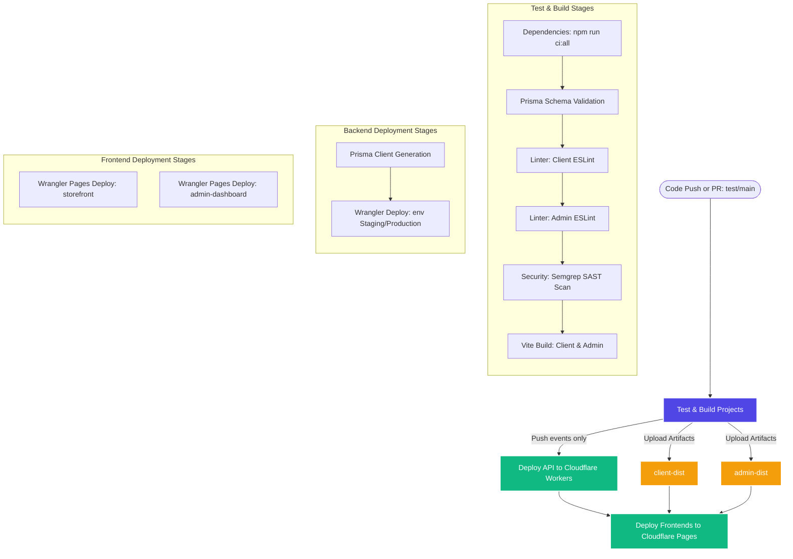

# 🚀 CI/CD Deployment Pipeline Documentation

The e-commerce project uses a fully automated **CI/CD Deployment Pipeline** to ensure the safety, quality, and continuity of every code change. The pipeline is powered by GitHub Actions and manages automated deployments to the Cloudflare infrastructure.

Pipeline definitions are located in [.github/workflows/deploy.yml](file:///C:/Users/yusuf/Github/e-commerce-cloudflare/.github/workflows/deploy.yml).

---

## 📐 Pipeline Flow Diagram

The Mermaid diagram below illustrates the pipeline trigger stages, job dependencies, and data flow:

---

## ⚙️ Pipeline Jobs & Details

The pipeline consists of three main jobs:

### 1. Test and Build Projects (`test-and-build`)

This job runs on both **Pull Request (PR)** and **Push** triggers. Its purpose is to validate code quality and perform static code analysis.

- **Dependencies:** None. This is the first job to run.
- **Stages:**
  1. **Node.js Setup:** Node.js v20 runtime is installed.
  2. **Dependency Installation:** `npm run ci:all` installs all sub-project dependencies (`client`, `admin`, `api`) across the monorepo with a clean install.
  3. **Database Validation:** `prisma validate` is run to validate the backend schema.
  4. **Lint Check (ESLint):** Linting rules are enforced across `client` and `admin` directories. The pipeline halts on any errors.
  5. **Security Scan (SAST):** Semgrep scans for vulnerabilities such as ReDoS, Format String, and Shell Injection.
  6. **Vite Build:** Frontend applications are compiled against the targeted API URLs:
     - If targeting the `test` branch → `STAGING_API_URL` is used.
     - If targeting the `main` branch → `PRODUCTION_API_URL` is used.
  7. **Artifact Upload:** The compiled `client/dist` and `admin/dist` directories are temporarily uploaded to GitHub Actions servers for use in subsequent jobs.

---

### 2. Deploy API to Cloudflare Workers (`deploy-backend`)

This job runs only on **direct Push** events (i.e., after a PR is approved and merged).

- **Dependencies:** Requires `test-and-build` to have completed successfully.
- **Stages:**
  1. **Environment Selection:**
     - Push to `test` branch → environment is set to `staging`.
     - Push to `main` branch → environment is set to `production`.
  2. **Prisma Client Generation:** The Prisma client is generated for Cloudflare D1 (`npx prisma generate`).
  3. **Wrangler Deployment:** `npx wrangler deploy --env <environment>` deploys the API to the target environment.
  4. **Required Secrets:** `CLOUDFLARE_API_TOKEN` and `CLOUDFLARE_ACCOUNT_ID`.

---

### 3. Deploy Frontends to Cloudflare Pages (`deploy-frontend`)

This job runs after the backend API has been successfully deployed, publishing the frontend interfaces.

- **Dependencies:** Requires both `test-and-build` and `deploy-backend` to have completed successfully.
- **Stages:**
  1. **Artifact Download:** The `client-dist` and `admin-dist` artifacts built in the first job are downloaded.
  2. **Pages Deployment:**
     - **Storefront:** Deployed to the `ecommerce-storefront` Pages project targeting the appropriate branch.
     - **Admin Dashboard:** Deployed to the `ecommerce-admin` Pages project targeting the appropriate branch.
  3. **Required Secrets:** `CLOUDFLARE_API_TOKEN` and `CLOUDFLARE_ACCOUNT_ID`.

---

## 🔒 Security & Secrets Configuration

The following repository secrets must be configured in your GitHub repository for the pipeline to function:

| Secret Name | Description |
| :--- | :--- |
| `CLOUDFLARE_ACCOUNT_ID` | Cloudflare Account ID |
| `CLOUDFLARE_API_TOKEN` | Cloudflare API Token with permissions for Workers, D1, R2, and Pages |
| `STAGING_API_URL` | Backend API address for the staging environment (e.g. `https://e-commerce-cloudflare-staging.yusuftalhaarabaci-91d.workers.dev`) |
| `PRODUCTION_API_URL` | Backend API address for the production environment (e.g. `https://api.e-market-domain.com`) |
