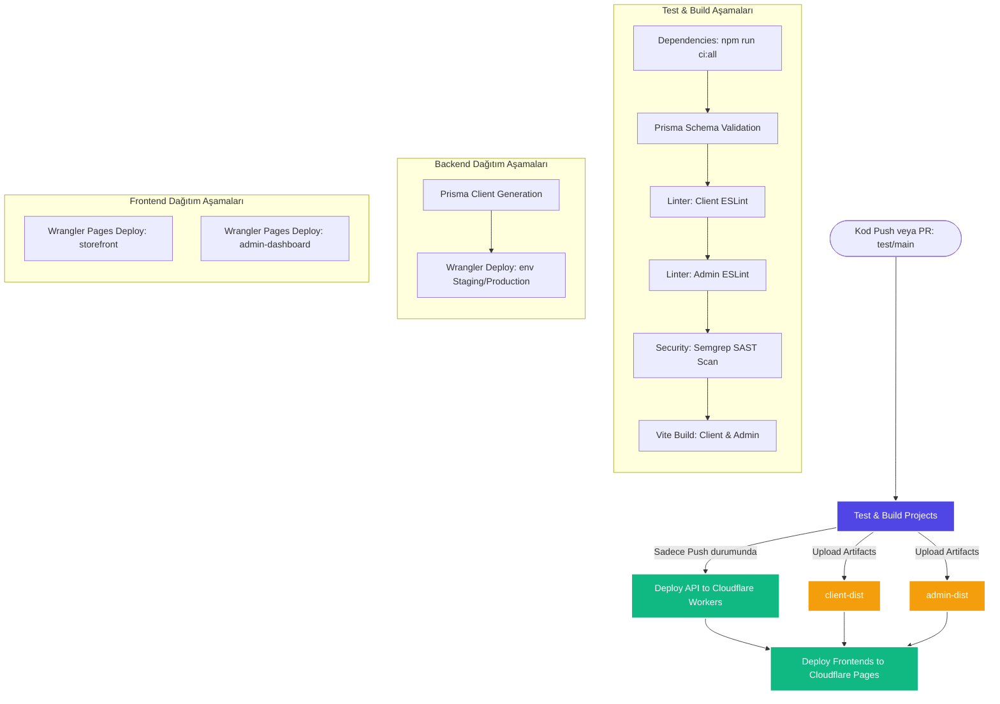

# 🚀 CI/CD Dağıtım Boru Hattı (Pipeline) Dokümantasyonu

E-Market projesi, her kod değişikliğinin güvenliğini, kalitesini ve sürekliliğini garanti altına almak amacıyla tam otomatik bir **CI/CD Dağıtım Boru Hattı** (Pipeline) kullanmaktadır. Bu boru hattı GitHub Actions entegrasyonu ile çalışır ve Cloudflare altyapısına otomatik dağıtımı yönetir.

Boru hattı tanımları [.github/workflows/deploy.yml](file:///C:/Users/yusuf/Github/e-commerce-cloudflare/.github/workflows/deploy.yml) dosyasında yer almaktadır.

---

## 📐 Pipeline Akış Diyagramı

Aşağıdaki Mermaid diyagramı, pipeline'ın tetiklenme aşamalarını, iş (job) bağımlılıklarını ve veri akışını göstermektedir:

---

## ⚙️ Boru Hattı İşleri (Jobs) ve Detayları

Pipeline üç ana işten (job) oluşur:

### 1. Test and Build Projects (`test-and-build`)
Bu iş, hem **Pull Request (PR)** hem de **Push** tetikleyicilerinde çalışır. Amacı kod kalitesini doğrulamak ve statik kod analizi yapmaktır.

*   **Bağımlılıklar:** Yok. İlk çalışan adımdır.
*   **Aşamalar:**
    1.  **Node.js Kurulumu:** Node.js v20 çalışma zamanı yüklenir.
    2.  **Bağımlılık Yükleme:** `npm run ci:all` komutu ile monorepo içerisindeki tüm alt projelerin (`client`, `admin`, `api`) bağımlılıkları temiz bir şekilde kurulur.
    3.  **Veritabanı Doğrulama:** Backend şemasını doğrulamak için `prisma validate` çalıştırılır.
    4.  **Kod Linter Kontrolü (ESLint):** `client` ve `admin` klasörlerindeki linter kuralları denetlenir. Hata varsa pipeline durdurulur.
    5.  **Güvenlik Taraması (SAST):** Semgrep aracı ile ReDoS, Format String ve Shell Injection gibi zafiyetler taranır.
    6.  **Vite Derleme (Build):** Frontend uygulamaları hedeflenen API URL'leri ile derlenir:
        *   `test` dalı hedef alındıysa `STAGING_API_URL` kullanılır.
        *   `main` dalı hedef alındıysa `PRODUCTION_API_URL` kullanılır.
    7.  **Artifakt Yükleme:** Derlenen `client/dist` ve `admin/dist` klasörleri sonraki adımlarda kullanılmak üzere GitHub Actions sunucularına geçici olarak yüklenir.

---

### 2. Deploy API to Cloudflare Workers (`deploy-backend`)
Bu iş, sadece kod **Doğrudan Push** (PR onaylanıp birleştirildikten sonra) edildiğinde çalışır.

*   **Bağımlılıklar:** `test-and-build` işinin başarıyla tamamlanmış olması gerekir.
*   **Aşamalar:**
    1.  **Dağıtım Ortamı Belirleme:**
        *   `test` dalına push yapıldıysa ortam `staging` olarak seçilir.
        *   `main` dalına push yapıldıysa ortam `production` olarak seçilir.
    2.  **Prisma İstemci Oluşturma:** Cloudflare D1 için Prisma istemcisi üretilir (`npx prisma generate`).
    3.  **Wrangler Dağıtımı:** `npx wrangler deploy --env <ortam>` komutu ile API, hedeflenen ortama deploy edilir.
    4.  **Kullanılan Gizli Anahtarlar (Secrets):** `CLOUDFLARE_API_TOKEN` ve `CLOUDFLARE_ACCOUNT_ID`.

---

### 3. Deploy Frontends to Cloudflare Pages (`deploy-frontend`)
Bu iş, backend API başarıyla dağıtıldıktan sonra frontend arayüzlerini yayına almak için çalışır.

*   **Bağımlılıklar:** `test-and-build` ve `deploy-backend` işlerinin başarıyla tamamlanmış olması gerekir.
*   **Aşamalar:**
    1.  **Artifakt İndirme:** İlk adımda derlenen `client-dist` ve `admin-dist` dosyaları indirilir.
    2.  **Sayfaları Dağıtma:**
        *   **Storefront:** `ecommerce-storefront` Pages projesine hedeflenen dala göre dağıtılır.
        *   **Admin Dashboard:** `ecommerce-admin` Pages projesine hedeflenen dala göre dağıtılır.
    3.  **Kullanılan Gizli Anahtarlar (Secrets):** `CLOUDFLARE_API_TOKEN` ve `CLOUDFLARE_ACCOUNT_ID`.

---

## 🔒 Güvenlik ve Secrets Yapılandırması

Pipeline'ın çalışabilmesi için GitHub deposunda aşağıdaki repository sırlarının (secrets) tanımlı olması gerekir:

| Gizli Anahtar Adı | Açıklama |
| :--- | :--- |
| `CLOUDFLARE_ACCOUNT_ID` | Cloudflare Hesap Kimliği (Account ID) |
| `CLOUDFLARE_API_TOKEN` | Workers, D1, R2 ve Pages yetkilerine sahip Cloudflare API Anahtarı |
| `STAGING_API_URL` | Test ortamındaki backend API adresi (Örn: `https://e-commerce-cloudflare-staging.yusuftalhaarabaci-91d.workers.dev`) |
| `PRODUCTION_API_URL` | Üretim ortamındaki backend API adresi (Örn: `https://api.e-market-domain.com`) |
