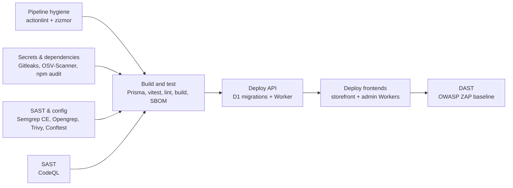

# 🚀 CI/CD Pipeline

All builds and deployments run through one fail-closed GitHub Actions workflow:
[`.github/workflows/devsecops-pipeline.yml`](../.github/workflows/devsecops-pipeline.yml).
The design and the role of each tool are described in
[`DEVSECOPS_PIPELINE.MD`](../DEVSECOPS_PIPELINE.MD).

There is no other deploy path: no local deploy script and no Cloudflare Git
integration, so code reaches Cloudflare only after every gate is green.

## Branches and environments

| Branch | Environment | Storefront | Admin | API |
| --- | --- | --- | --- | --- |
| `staging` | staging | staging.ecommerceflaredev.web.tr | staging-admin.ecommerceflaredev.web.tr | staging-api.ecommerceflaredev.web.tr |
| `production` (default) | production | ecommerceflaredev.web.tr | admin.ecommerceflaredev.web.tr | api.ecommerceflaredev.web.tr |

Flow: feature branch → PR to `staging` → merge deploys staging → PR
`staging` → `production` → merge deploys production. Dependabot also opens its
PRs against `staging`.

Both branches are protected by the `protect-production-staging` ruleset: no
deletion, no force-push, changes only via PR, and the five gate checks below
must pass. Each GitHub environment accepts deployments only from its own
branch, and the `production` environment requires a reviewer: a production
release waits for approval before the API deploy and again before the frontend
deploy.

## Flow

```mermaid
graph LR
    H[Pipeline hygiene<br/>actionlint + zizmor] --> B
    S[Secrets & dependencies<br/>Gitleaks, OSV-Scanner, npm audit] --> B
    C[SAST & config<br/>Semgrep CE, Opengrep, Trivy, Conftest] --> B
    Q[SAST<br/>CodeQL] --> B
    B[Build and test<br/>Prisma, vitest, lint, build, SBOM] --> DA[Deploy API<br/>D1 migrations + Worker]
    DA --> DF[Deploy frontends<br/>storefront + admin Workers]
    DF --> Z[DAST<br/>OWASP ZAP baseline]
```

The four gate jobs run in parallel; `Build and test` needs all of them, and the
deploy and DAST jobs run only on a **push** to `staging` or `production`. Pull
requests run every gate and the build, never a deploy.

## Jobs

| Job | What it does | Fails on |
| --- | --- | --- |
| Pipeline hygiene | actionlint, zizmor (pinned binaries, checksum-verified) | any medium+ zizmor finding |
| Secrets and dependencies | Gitleaks over full history, OSV-Scanner, `npm audit --audit-level=high` in root/api/client/admin | any leak, any OSV finding, high/critical audit |
| SAST and config | Trivy misconfig; Conftest `policy/wrangler.rego` on `api/wrangler.toml`; Semgrep CE with the JS/TS security rules of `semgrep/semgrep-rules` pinned to a commit; Opengrep with the Workers rules in `research/rules/edge` (`--taint-intrafile`) on `api/src` | HIGH/CRITICAL misconfig, any policy violation, any Semgrep or Opengrep finding |
| SAST (CodeQL) | CodeQL `javascript-typescript` | analysis failure |
| Build and test | `npm run ci:all`, CycloneDX SBOMs (`npm sbom`) for root/api/client/admin uploaded as `sbom-cyclonedx`, `prisma validate/generate`, `npm test` (api), lint and build of client/admin with the environment's `VITE_API_URL` | any step |
| Deploy API | `wrangler d1 migrations apply DB --remote`, `wrangler deploy --env <env>` | any step |
| Deploy frontends | `wrangler deploy --env <env>` in `client/` and `admin/` (Workers static assets) | any step |
| DAST | OWASP ZAP baseline (passive, 2-minute spider) against the storefront and `/api/v1/products` of the environment just deployed; HTML/JSON/Markdown report as `zap-<target>` artifact and in the job summary. The admin dashboard sits behind Cloudflare Access and is not scanned. Rule overrides with reasons go in `.zap/rules.tsv`. | any High risk alert |

The research corpus under `research/` is intentionally vulnerable and is
excluded from Semgrep, Trivy, Gitleaks and CodeQL here; it is measured by
`security-research.yml` instead.

## Versions

All actions are pinned to commit SHAs. Docker images (Gitleaks, OSV-Scanner,
Conftest, ZAP) are pinned by digest, downloaded binaries (actionlint, zizmor,
Opengrep) are verified by SHA-256, and Semgrep rules come from a fixed
`semgrep-rules` commit instead of the live registry. Node.js 22.23.3 and
Wrangler 4.145.0 are set in the workflow `env`.

## Runtime protection

The API Worker applies per-IP limits with the Workers Rate Limiting binding
(`api/src/middlewares/rateLimit.js`, bindings in `api/wrangler.toml`): 300
requests/minute on `/api/*` and 30 requests/minute on order, payment and return
routes, answering `429` with `Retry-After`. Zone-level WAF, the free rate
limiting rule, Bot Fight Mode and TLS/HSTS settings are configured in the
Cloudflare dashboard; the steps are in `DEVSECOPS_PIPELINE.MD` section 5.2.

## Local hook

`.husky/pre-commit` blocks local database files and runs Gitleaks on staged
changes. Gitleaks is required: install the pinned version with
`sh scripts/install-gitleaks.sh` (into the gitignored `.tools/`).

## Secrets

| Secret | Purpose |
| --- | --- |
| `CLOUDFLARE_API_TOKEN` | Account API token, least privilege: Workers Scripts, D1, Workers R2 Storage (Edit), Account Settings (Read), Zone Workers Routes (Edit) and Zone (Read) on `ecommerceflaredev.web.tr` |
| `CLOUDFLARE_ACCOUNT_ID` | Cloudflare account ID |

The application itself has no deploy-time secrets: admin access is handled by
Cloudflare Access (see the deployment guide).

## Other workflows

| Workflow | Trigger | Purpose |
| --- | --- | --- |
| `workflow-security.yml` | PRs touching workflows | actionlint and zizmor report |
| `research-checks.yml` | PRs touching `research` | ground-truth schema and analysis tests |
| `security-research.yml` | manual | research measurement pipeline (all scanners, SARIF, timings) |
| `backup.yml` | manual | encrypted export of the production D1 to Google Drive |
