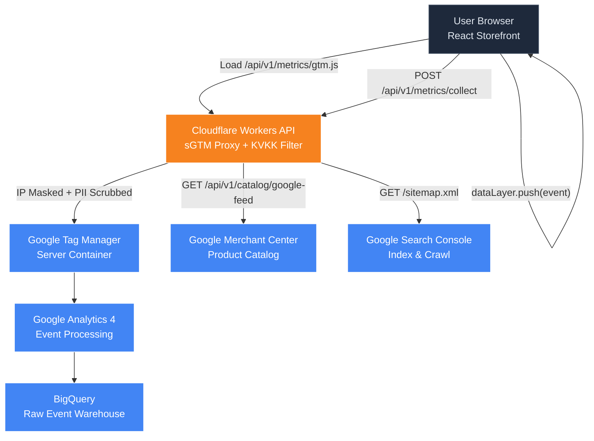

# Google Services Integration Guide

This guide covers the complete technical integration of Google's data platform with E-Market's serverless Cloudflare architecture. The stack covers four interconnected services — **Google Tag Manager (GTM)**, **Google Analytics 4 (GA4)**, **Google Search Console (GSC)**, and **Google Merchant Center (GMC)** — all wired together in a first-party, KVKK-compliant data pipeline.

---

## Architecture Overview



The core principle is that **no analytics traffic goes directly from the browser to Google**. Everything routes through the Cloudflare Worker, which masks IPs and scrubs PII before forwarding — making the pipeline 100% first-party and KVKK-compliant.

---

## 1. Server-Side Google Tag Manager (sGTM)

### Why Server-Side?

Client-side GTM (loaded directly from `googletagmanager.com`) has two critical problems in modern web:

| Problem | Impact |
| :--- | :--- |
| AdBlock / uBlock Origin blocks `googletagmanager.com` | Up to 30–40% analytics data loss |
| Apple ITP (Intelligent Tracking Prevention) | Cookie lifetime capped to 1–7 days |
| Third-party cookie deprecation | Cross-session tracking breaks |

**Server-Side GTM solves all three.** The GTM script is served from your own domain (`/api/v1/metrics/gtm.js`), so it appears first-party to browsers and ad blockers alike.

### How It Works in E-Market

The Cloudflare Worker (`api/src/routes/metricsRoutes.js`) acts as a transparent proxy for both the GTM loader script and the GA4 event collector:

**GTM Script Proxy** — serves the GTM JavaScript from your domain:

```javascript
// GET /api/v1/metrics/gtm.js
app.get('/gtm.js', async (c) => {
  const GTM_ID = c.env.GTM_CONTAINER_ID; // e.g. "GTM-XXXXXXX"
  const targetUrl = `https://www.googletagmanager.com/gtm.js?id=${GTM_ID}`;

  const response = await fetch(targetUrl, {
    headers: { 'User-Agent': 'Cloudflare-Worker-sGTM-Proxy/1.0' }
  });

  return c.text(await response.text(), 200, {
    'Content-Type': 'application/javascript',
    'Cache-Control': 'public, max-age=3600'
  });
});
```

**Analytics Event Collector** — receives events, strips PII, and forwards to GA4:

```javascript
// POST /api/v1/metrics/collect
app.post('/collect', async (c) => {
  const payload = await c.req.json();

  // KVKK: Mask client IP (last octet → 0)
  const rawIp = c.req.header('cf-connecting-ip') || '';
  const maskedIp = rawIp.replace(/\.\d+$/, '.0');

  // KVKK: Strip PII from payload
  const safePayload = scrubPII(payload);

  // Forward sanitized event to GA4 Measurement Protocol
  await fetch(`https://www.google-analytics.com/mp/collect?measurement_id=${c.env.GA4_MEASUREMENT_ID}&api_secret=${c.env.GA4_API_SECRET}`, {
    method: 'POST',
    headers: { 'X-Forwarded-For': maskedIp },
    body: JSON.stringify(safePayload)
  });

  return c.json({ status: 'ok' });
});
```

### Storefront GTM Integration

In the React storefront (`client/src/index.html`), load GTM from your own Worker endpoint instead of Google's servers:

```html
<!-- In <head>: Load GTM from your own domain (first-party) -->
<script>
  (function(w,d,s,l,i){
    w[l]=w[l]||[];
    w[l].push({'gtm.start': new Date().getTime(), event:'gtm.js'});
    var f=d.getElementsByTagName(s)[0],
        j=d.createElement(s),
        dl=l!='dataLayer'?'&l='+l:'';
    j.async=true;
    // 👇 Point to your Worker, NOT googletagmanager.com
    j.src='/api/v1/metrics/gtm.js?id='+i+dl;
    f.parentNode.insertBefore(j,f);
  })(window,document,'script','dataLayer','GTM-XXXXXXX');
</script>

<!-- In <body>: No-script fallback -->
<noscript>
  <iframe src="/api/v1/metrics/ns.html?id=GTM-XXXXXXX"
    height="0" width="0" style="display:none;visibility:hidden"></iframe>
</noscript>
```

---

## 2. Data Layer (dataLayer) Event Schemas

The storefront pushes structured events to `window.dataLayer`. These are the standard schemas for E-Market's Turkish e-commerce context (TRY currency).

### Product View

```javascript
window.dataLayer = window.dataLayer || [];
window.dataLayer.push({ ecommerce: null }); // Clear previous ecommerce data

window.dataLayer.push({
  event: 'view_item',
  ecommerce: {
    currency: 'TRY',
    value: 1250.00,
    items: [{
      item_id: 'p1',
      item_name: 'Kablosuz Oyuncu Kulaklığı',
      item_category: 'Bilgisayar Çevre Birimleri',
      item_brand: 'SoundMax',
      price: 1250.00,
      quantity: 1
    }]
  }
});
```

### Add to Cart

```javascript
window.dataLayer.push({ ecommerce: null });
window.dataLayer.push({
  event: 'add_to_cart',
  ecommerce: {
    currency: 'TRY',
    value: 1250.00,
    items: [{
      item_id: 'p1',
      item_name: 'Kablosuz Oyuncu Kulaklığı',
      item_category: 'Bilgisayar Çevre Birimleri',
      price: 1250.00,
      quantity: 1
    }]
  }
});
```

### Begin Checkout

```javascript
window.dataLayer.push({ ecommerce: null });
window.dataLayer.push({
  event: 'begin_checkout',
  ecommerce: {
    currency: 'TRY',
    value: 3100.00,
    items: [
      { item_id: 'p1', item_name: 'Kablosuz Oyuncu Kulaklığı', price: 1250.00, quantity: 1 },
      { item_id: 'p2', item_name: 'Mekanik Klavye (RGB)', price: 1850.00, quantity: 1 }
    ]
  }
});
```

### Purchase (Conversion)

```javascript
window.dataLayer.push({ ecommerce: null });
window.dataLayer.push({
  event: 'purchase',
  ecommerce: {
    transaction_id: 'ORD-2026-99432', // Unique order ID from D1
    value: 3100.00,
    tax: 496.00,           // 18% VAT (KDV)
    shipping: 0,           // Free shipping
    currency: 'TRY',
    items: [
      { item_id: 'p1', item_name: 'Kablosuz Oyuncu Kulaklığı', price: 1250.00, quantity: 1 },
      { item_id: 'p2', item_name: 'Mekanik Klavye (RGB)', price: 1850.00, quantity: 1 }
    ]
  }
});
```

> [!TIP]
> Always push `{ ecommerce: null }` before each ecommerce event to prevent data from previous pushes contaminating the current event in GTM.

---

## 3. Google Analytics 4 (GA4)

### Setup

1. Go to [analytics.google.com](https://analytics.google.com) → Create a **GA4 Property**
2. Under **Data Streams** → Add Web Stream → enter your storefront URL
3. Copy the **Measurement ID** (`G-XXXXXXXXXX`) and **API Secret** (from Measurement Protocol)
4. Add to your Worker secrets:

```bash
npx wrangler secret put GA4_MEASUREMENT_ID --env production
npx wrangler secret put GA4_API_SECRET --env production
```

### BigQuery Export (Free with Google Workspace)

GA4 can stream raw event data to BigQuery in real time at no extra cost if you have Google Workspace Business Standard or higher.

**Setup:**
1. In GA4 → **Admin** → **BigQuery Links** → Link
2. Select your GCP project (create one at [console.cloud.google.com](https://console.cloud.google.com) if needed)
3. Choose **Streaming export** for real-time data

**Example SQL query** — abandoned cart analysis:

```sql
SELECT
  user_pseudo_id,
  MAX(IF(event_name = 'add_to_cart', event_timestamp, NULL)) AS added_to_cart_at,
  MAX(IF(event_name = 'purchase', event_timestamp, NULL)) AS purchased_at
FROM `your-project.analytics_XXXXXXXXX.events_*`
WHERE _TABLE_SUFFIX >= FORMAT_DATE('%Y%m%d', DATE_SUB(CURRENT_DATE(), INTERVAL 30 DAY))
GROUP BY 1
HAVING purchased_at IS NULL AND added_to_cart_at IS NOT NULL
ORDER BY added_to_cart_at DESC;
```

### Predictive Metrics

Once GA4 has accumulated ~1,000 purchasers and ~1,000 non-purchasers in the past 28 days, it automatically activates:
- **Purchase Probability** — likelihood a user will purchase in the next 7 days
- **Churn Probability** — likelihood a returning user will not return in the next 7 days
- **Revenue Prediction** — expected revenue from a user in the next 28 days

These become available as **Audiences** you can use for Google Ads remarketing.

---

## 4. Google Search Console (GSC)

### Setup

1. Go to [search.google.com/search-console](https://search.google.com/search-console)
2. Add your storefront domain as a property (use the **Domain** option for full coverage)
3. Verify ownership via DNS TXT record (add through your DNS provider)
4. Submit your sitemap:

```
https://your-storefront-domain.com/sitemap.xml
```

The sitemap is dynamically generated by the Cloudflare Worker at `/sitemap.xml` and includes all product and category URLs from the D1 database.

### JSON-LD Structured Data

Add JSON-LD Product schema to each product detail page. This enables **Rich Results** (price, availability, ratings) directly in Google Search:

```jsx
// In your React product detail component:
function ProductStructuredData({ product }) {
  const schema = {
    "@context": "https://schema.org/",
    "@type": "Product",
    "name": product.name,
    "description": product.description,
    "image": `${import.meta.env.VITE_CDN_URL}/products/${product.id}.webp`,
    "brand": {
      "@type": "Brand",
      "name": product.brand
    },
    "offers": {
      "@type": "Offer",
      "priceCurrency": "TRY",
      "price": product.price.toFixed(2),
      "availability": product.stock > 0
        ? "https://schema.org/InStock"
        : "https://schema.org/OutOfStock",
      "seller": {
        "@type": "Organization",
        "name": "E-Market"
      }
    }
  };

  return (
    <script
      type="application/ld+json"
      dangerouslySetInnerHTML={{ __html: JSON.stringify(schema) }}
    />
  );
}
```

> [!NOTE]
> Rich Results can take 2–4 weeks to appear after implementation. Use the [Rich Results Test](https://search.google.com/test/rich-results) tool to validate your markup immediately.

---

## 5. Google Merchant Center (GMC)

### Setup

1. Go to [merchants.google.com](https://merchants.google.com) and create an account
2. Verify and claim your storefront domain
3. Under **Products** → **Feeds** → **Add Feed** → choose **Scheduled Fetch**
4. Set the fetch URL to:
   ```
   https://your-api-worker.workers.dev/api/v1/catalog/google-feed
   ```
5. Set fetch frequency to **daily**

### Dynamic XML Feed

The Worker generates the GMC-compatible feed live from D1:

```javascript
// GET /api/v1/catalog/google-feed
app.get('/google-feed', async (c) => {
  const { results } = await c.env.DB.prepare(
    'SELECT p.*, b.name as brandName FROM urunler p LEFT JOIN markalar b ON p.markaId = b.id WHERE p.aktif = 1'
  ).all();

  const baseUrl = c.env.CLIENT_URL || 'https://your-storefront.com';
  const cdnUrl  = c.env.CDN_URL    || 'https://cdn.your-storefront.com';

  let xml = `<?xml version="1.0" encoding="UTF-8"?>
<rss version="2.0" xmlns:g="http://base.google.com/ns/1.0">
<channel>
  <title>E-Market Ürün Kataloğu</title>
  <link>${baseUrl}</link>
  <description>Cloudflare D1 veritabanından dinamik ürün kataloğu</description>`;

  for (const p of results) {
    xml += `
  <item>
    <g:id>${p.id}</g:id>
    <g:title>${escapeXml(p.ad)}</g:title>
    <g:description>${escapeXml(p.aciklama || '')}</g:description>
    <g:link>${baseUrl}/urun/${p.slug}</g:link>
    <g:image_link>${cdnUrl}/products/${p.id}.webp</g:image_link>
    <g:price>${parseFloat(p.fiyat).toFixed(2)} TRY</g:price>
    <g:availability>${p.stok > 0 ? 'in_stock' : 'out_of_stock'}</g:availability>
    <g:brand>${escapeXml(p.brandName || 'E-Market')}</g:brand>
    <g:condition>new</g:condition>
    <g:google_product_category>Electronics</g:google_product_category>
  </item>`;
  }

  xml += '\n</channel>\n</rss>';

  return c.text(xml, 200, {
    'Content-Type': 'application/xml; charset=UTF-8',
    'Cache-Control': 'public, max-age=3600'
  });
});
```

### Meta / Instagram Catalog Cross-Sync

The same XML feed endpoint is 100% compatible with **Meta Business Suite** (Facebook & Instagram Shopping). In Meta Business Suite:

1. **Commerce Manager** → **Catalog** → **Data Sources** → **Add Data Source**
2. Choose **Use a Data Feed** → **Scheduled Feed**
3. Paste the same URL: `/api/v1/catalog/google-feed`

One D1 database endpoint feeds Google Shopping, Google Images, Instagram Shopping, and Facebook Shops simultaneously.

### Performance Max (PMax) Campaigns

When the GMC feed and GA4 purchase conversions are both flowing:
1. In **Google Ads** → **New Campaign** → **Performance Max**
2. Link your GMC account and GA4 property
3. Set a **ROAS (Return on Ad Spend)** target bidding strategy

Google's AI will automatically allocate budget across Search, Shopping, Display, YouTube, and Discover to maximize conversions.

---

## 6. KVKK-Compliant Consent Mode v2

Turkish data protection law (KVKK) and EU GDPR both require explicit user consent before writing any analytical cookies. Google's **Consent Mode v2** is the mechanism to implement this while preserving measurement accuracy.

### How It Works

```
User clicks "Accept" → CMP sets consent → GTM activates GA4 tags (full data)
User clicks "Reject" → CMP sets denied → GTM sends anonymous pings only (no PII stored)
```

### Frontend Implementation

Initialize Consent Mode **before** the GTM snippet loads:

```javascript
// Must come BEFORE the GTM <script> tag in <head>
window.dataLayer = window.dataLayer || [];
function gtag() { dataLayer.push(arguments); }

// Set default denied state (KVKK safe default)
gtag('consent', 'default', {
  'analytics_storage': 'denied',
  'ad_storage': 'denied',
  'ad_user_data': 'denied',
  'ad_personalization': 'denied',
  'wait_for_update': 500 // Wait up to 500ms for CMP to update
});
```

When the user accepts consent (e.g., via a Cookiebot or custom CMP):

```javascript
// Called by your CMP when user clicks "Accept All"
function onConsentAccepted() {
  gtag('consent', 'update', {
    'analytics_storage': 'granted',
    'ad_storage': 'granted',
    'ad_user_data': 'granted',
    'ad_personalization': 'granted'
  });
}

// Called by your CMP when user clicks "Reject"
function onConsentRejected() {
  // Leave as 'denied' — GTM sends anonymous pings only
  // No cookies are written, no PII is collected
}
```

### GTM Container Configuration

In GTM Server Container, configure **Consent Initialization** triggers and set your GA4 tag to respect consent signals. GA4 will automatically model conversion data using **Behavioral Modeling** when consent is denied, so your reports stay statistically accurate even with partial consent.

> [!IMPORTANT]
> Under KVKK regulations enforced by the **KVKK Kurulu**, failing to obtain consent before writing analytical cookies can result in administrative fines. The Consent Mode v2 approach described here keeps your analytics pipeline fully compliant.

---

## Environment Variables Reference

Add these to your `api/wrangler.toml` (non-sensitive placeholders) and set real values as Wrangler secrets:

```toml
# wrangler.toml - placeholder values
[vars]
GTM_CONTAINER_ID   = "GTM-XXXXXXX"
GA4_MEASUREMENT_ID = "G-XXXXXXXXXX"
```

```bash
# Set production secrets via Wrangler CLI
npx wrangler secret put GA4_API_SECRET         --env production
npx wrangler secret put GOOGLE_MERCHANT_TOKEN  --env production
```

| Variable | Description |
| :--- | :--- |
| `GTM_CONTAINER_ID` | Your GTM Web Container ID (e.g. `GTM-XXXXXXX`) |
| `GA4_MEASUREMENT_ID` | GA4 Measurement ID (e.g. `G-XXXXXXXXXX`) |
| `GA4_API_SECRET` | GA4 Measurement Protocol API Secret |
| `GOOGLE_MERCHANT_TOKEN` | Verification token for Merchant Center domain claim |

---

## Related Documentation

- [CI/CD Pipeline](cicd_pipeline.md)
- [KVKK Compliance Guide](kvkk_compliance.md)
- [Google Drive Backup](google_drive_backup.md)
