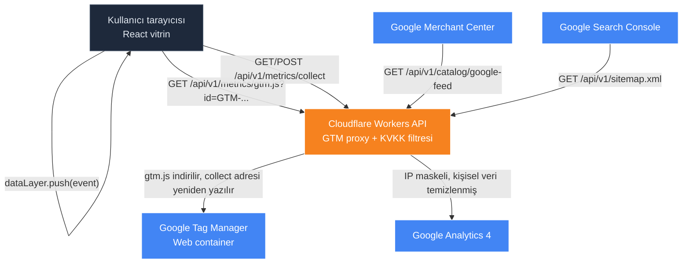

# Google Servisleri Entegrasyon Rehberi

Bu rehber Google'ın veri platformunun E-Market'in sunucusuz Cloudflare
mimarisiyle nasıl birleştiğini anlatır. Kapsanan servisler: **Google Tag
Manager (GTM)**, **Google Analytics 4 (GA4)**, **Google Search Console (GSC)**
ve **Google Merchant Center (GMC)**.

---

## Mimariye genel bakış


```mermaid
graph TD
    classDef cf fill:#f6821f,stroke:#fff,color:#fff
    classDef google fill:#4285F4,stroke:#fff,color:#fff
    classDef browser fill:#1e293b,stroke:#475569,color:#e2e8f0

    Browser["Kullanıcı tarayıcısı\nReact vitrin"]:::browser
    Worker["Cloudflare Workers API\nGTM proxy + KVKK filtresi"]:::cf
    GTM["Google Tag Manager\nWeb container"]:::google
    GA4["Google Analytics 4"]:::google
    GMC["Google Merchant Center"]:::google
    GSC["Google Search Console"]:::google

    Browser -->|"dataLayer.push(event)"| Browser
    Browser -->|"GET /api/v1/metrics/gtm.js?id=GTM-..."| Worker
    Worker -->|"gtm.js indirilir, collect adresi yeniden yazılır"| GTM
    Browser -->|"GET/POST /api/v1/metrics/collect"| Worker
    Worker -->|"IP maskeli, kişisel veri temizlenmiş"| GA4
    GMC -->|"GET /api/v1/catalog/google-feed"| Worker
    GSC -->|"GET /api/v1/sitemap.xml"| Worker
```

Temel ilke: **GA4 ölçüm trafiği tarayıcıdan doğrudan Google'a gitmez.** GTM
betiği ve GA4 olayları Cloudflare Worker üzerinden geçer. Worker iletmeden
önce IP adresini maskeler ve kişisel verileri temizler. Ayrıntılar:
[KVKK Uyumu](kvkk_compliance.md).

---

## 1. Yapılandırma: kimlikler admin panelinden gelir

İzleme kimlikleri kodda veya `wrangler.toml` içinde değil, admin panelindeki
**Sistem Ayarları** ekranında tutulur (`sistem_ayarlari` tablosu):

| Ayar | Alan | Kullanım |
| --- | --- | --- |
| GTM container kimliği | `gtmContainerId` | `GTM-XXXXXXX`; doluysa vitrin GTM'i proxy üzerinden yükler |
| GA4 ölçüm kimliği | `ga4MeasurementId` | `G-XXXXXXXXXX`; GTM içindeki GA4 etiketinde kullanılır |
| Meta Pixel kimliği | `metaPixelId` | Doluysa Meta Pixel yüklenir |
| Merchant feed token'ı | `googleMerchantToken` | Doluysa ürün feed'i yalnızca `?token=` ile açılır |

Vitrin, açılışta `GET /api/v1/settings` ile bu ayarları alır
(`client/src/context/SettingsContext.jsx`) ve GTM ile Pixel'i başlatır.

---

## 2. GTM proxy'si

### Neden proxy?

| Sorun | Etki |
| :--- | :--- |
| Reklam engelleyiciler `googletagmanager.com` adresini engeller | Analitik veri kaybı |
| Tarayıcıların izleme önleme özellikleri (ör. Safari ITP) | Çerez ömrü kısalır |
| IP adresi ve kişisel veri doğrudan Google'a gider | KVKK riski |

GTM betiği API alan adından sunulduğu için birinci taraf olarak görünür ve
GA4 istekleri Worker'dan geçerken temizlenebilir.

### E-Market'te nasıl çalışır

Kod: `api/src/routes/metricsRoutes.js` (tüm yollarda `kvkkMiddleware` çalışır).

1. **`GET /api/v1/metrics/gtm.js?id=GTM-XXXXXXX`**
   - `id`, `^GTM-[A-Z0-9]{4,12}$` kalıbına uymuyorsa istek 400 ile reddedilir.
   - Worker, `https://www.googletagmanager.com/gtm.js` adresinden container'ı
     indirir. Adres sabittir; kimlik yalnızca kodlanmış bir sorgu parametresi
     olarak eklenir (SSRF koruması).
   - Betik içindeki `www.google-analytics.com/g/collect` adresleri
     `<API>/api/v1/metrics/collect` olarak yeniden yazılır ve betik
     `Cache-Control: public, max-age=3600` ile döner.
2. **`GET` veya `POST /api/v1/metrics/collect`**
   - Sorgu dizgesi ve gövde kişisel veriden temizlenir.
   - İstek `https://www.google-analytics.com/g/collect` adresine iletilir;
     `uip` parametresi maskeli IP olur.

### Vitrin tarafı

`client/src/utils/analytics.js` içindeki `initGTM(gtmId)` fonksiyonu
`dataLayer`'ı başlatır ve `<API>/api/v1/metrics/gtm.js?id=<gtmId>` betiğini
sayfaya ekler. HTML'e elle GTM snippet'i eklemeye gerek yoktur.

> [!WARNING]
> Meta Pixel (`initFacebookPixel`) proxy'den geçmez; doğrudan
> `connect.facebook.net` adresinden yüklenir ve kişisel veri temizliği
> uygulanmaz. Yalnızca kullanıcı pazarlama çerezlerine rıza verdikten sonra
> yüklenmelidir (bkz. bölüm 6).

---

## 3. dataLayer olayları

Vitrin, GA4 e-ticaret şemasına uygun olayları `window.dataLayer`'a gönderir
(para birimi TRY). Yardımcı fonksiyonlar `client/src/utils/analytics.js`
içindedir:

| Olay | Fonksiyon | Tetiklendiği yer |
| --- | --- | --- |
| `view_item` | `trackViewItem(product)` | Ürün detay sayfası |
| `add_to_cart` | `trackAddToCart(product, quantity, selectedColor)` | Sepete ekleme |
| `begin_checkout` | `trackBeginCheckout(cartItems, totalValue)` | Ödeme sayfası |
| `purchase` | `trackPurchase(transactionId, cartItems, totalValue, shippingFee)` | Ödeme başarılı sayfası |

Her olaydan önce `{ ecommerce: null }` gönderilir; böylece önceki olayın
verisi GTM'de yeni olaya karışmaz. Örnek `purchase` olayı:

```javascript
window.dataLayer.push({ ecommerce: null });
window.dataLayer.push({
  event: 'purchase',
  ecommerce: {
    transaction_id: 'SIP-2026-99432', // sipariş numarası
    value: 3100.00,
    shipping: 0,
    currency: 'TRY',
    items: [
      { item_id: 'p1', item_name: 'Kablosuz Oyuncu Kulaklığı', price: 1250.00, quantity: 1 },
      { item_id: 'p2', item_name: 'Mekanik Klavye (RGB)', price: 1850.00, quantity: 1 }
    ]
  }
});
```

GTM'de bu olaylar için GA4 Event etiketleri oluşturun ve "Send Ecommerce data"
seçeneğiyle `dataLayer`'dan okuyun.

---

## 4. Google Analytics 4

### Kurulum

1. [analytics.google.com](https://analytics.google.com) üzerinde bir **GA4
   mülkü** oluşturun.
2. **Data Streams** → **Add Web Stream** ile vitrin adresini ekleyin.
3. **Measurement ID** değerini (`G-XXXXXXXXXX`) kopyalayın ve admin panelinde
   `ga4MeasurementId` alanına girin.
4. GTM container'ında bu kimlikle bir **Google Tag** oluşturup tüm sayfalarda
   tetikleyin. Container'ı yayınlayın ve kimliğini admin panelinde
   `gtmContainerId` alanına girin.

### BigQuery aktarımı

GA4, ham olay verisini BigQuery'ye aktarabilir (günlük aktarım ücretsizdir;
BigQuery depolama ve sorgu ücretleri ayrıca geçerlidir).

1. GA4 → **Admin** → **BigQuery Links** → **Link**.
2. GCP projenizi seçin.
3. **Daily** veya **Streaming** aktarımı seçin.

**Örnek sorgu**, terk edilmiş sepet analizi:

```sql
SELECT
  user_pseudo_id,
  MAX(IF(event_name = 'add_to_cart', event_timestamp, NULL)) AS added_to_cart_at,
  MAX(IF(event_name = 'purchase', event_timestamp, NULL)) AS purchased_at
FROM `your-project.analytics_XXXXXXXXX.events_*`
WHERE _TABLE_SUFFIX >= FORMAT_DATE('%Y%m%d', DATE_SUB(CURRENT_DATE(), INTERVAL 30 DAY))
GROUP BY 1
HAVING purchased_at IS NULL AND added_to_cart_at IS NOT NULL
ORDER BY added_to_cart_at DESC;
```

### Tahmine dayalı metrikler

GA4, son 28 günde yeterli sayıda satın alan ve almayan kullanıcı biriktiğinde
(Google'ın eşiği yaklaşık 1.000'er kullanıcıdır) şu metrikleri açar:

- **Satın alma olasılığı:** kullanıcının 7 gün içinde satın alma ihtimali
- **Kayıp olasılığı:** aktif kullanıcının 7 gün içinde dönmeme ihtimali
- **Gelir tahmini:** kullanıcıdan 28 gün içinde beklenen gelir

Bu metrikler Google Ads yeniden pazarlaması için **kitle** olarak
kullanılabilir.

---

## 5. Google Search Console ve yapısal veri

### Sitemap

Sitemap, API Worker'ı tarafından D1'deki ürünlerden dinamik olarak üretilir
(`api/src/controllers/seoController.js`):

- `https://api.ecommerceflaredev.web.tr/sitemap.xml`
- `https://api.ecommerceflaredev.web.tr/api/v1/sitemap.xml`

Vitrinin `robots.txt` dosyası ikinci adresi gösterir. Sitemap başka bir alt
alan adında olduğundan GSC'de **Domain** türünde mülk (DNS TXT kaydıyla
doğrulanan, tüm alt alan adlarını kapsayan) kullanın; ardından sitemap
adresini **Sitemaps** bölümünden gönderin.

### JSON-LD yapısal verisi

Ürün sayfaları, arama sonuçlarında fiyat ve stok bilgisinin (Rich Results)
görünmesi için `Product` şemasında JSON-LD üretir
(`client/src/utils/structuredData.js`, `client/src/components/SEO.jsx`).
Canonical adresler `https://ecommerceflaredev.web.tr` alan adına göre
üretilir.

> [!NOTE]
> Rich Results'ın görünmesi haftalar sürebilir. İşaretlemeyi
> [Rich Results Test](https://search.google.com/test/rich-results) aracıyla
> hemen doğrulayabilirsiniz.

---

## 6. KVKK uyumlu Consent Mode v2

KVKK ve GDPR, analitik ve pazarlama çerezlerinden önce kullanıcının açık
rızasını ister. Google'ın **Consent Mode v2** özelliği bunu ölçüm
doğruluğunu koruyarak uygular.

> [!IMPORTANT]
> **Yayın öncesi yapılacak:** Vitrin şu an GTM ve Meta Pixel'i, ayarlar
> yüklenir yüklenmez rıza beklemeden başlatıyor. Canlıya almadan önce bir CMP
> (rıza yönetim platformu) ekleyin ve aşağıdaki varsayılan `denied` durumunu
> GTM yüklenmeden önce ayarlayın. Meta Pixel'i yalnızca pazarlama rızasından
> sonra başlatın.

### Nasıl çalışır

```text
"Kabul et" → CMP rızayı günceller → GTM, GA4 etiketlerini tam veriyle çalıştırır
"Reddet"   → durum denied kalır → GTM yalnızca çerezsiz, anonim ping gönderir
```

### Vitrin uygulaması

Consent Mode varsayılanı GTM'den **önce** ayarlanmalıdır. E-Market'te bu,
`initGTM` çağrısından önce yapılmalıdır:

```javascript
window.dataLayer = window.dataLayer || [];
function gtag() { dataLayer.push(arguments); }

// KVKK için güvenli varsayılan: her şey reddedilmiş
gtag('consent', 'default', {
  analytics_storage: 'denied',
  ad_storage: 'denied',
  ad_user_data: 'denied',
  ad_personalization: 'denied',
  wait_for_update: 500 // CMP'nin güncellemesi için 500 ms bekle
});
```

Kullanıcı rıza verdiğinde CMP şunu çağırır:

```javascript
function onConsentAccepted() {
  gtag('consent', 'update', {
    analytics_storage: 'granted',
    ad_storage: 'granted',
    ad_user_data: 'granted',
    ad_personalization: 'granted'
  });
}
```

Reddedildiğinde durum `denied` olarak kalır; çerez yazılmaz.

### GTM container ayarı

GTM'de **Consent Initialization** tetikleyicisini kurun ve GA4 etiketinin rıza
sinyallerine uymasını sağlayın. Rıza reddedildiğinde GA4, raporları
istatistiksel olarak tutarlı tutmak için davranışsal modelleme kullanır.

> [!IMPORTANT]
> Analitik çerezlerinden önce rıza alınmaması Kişisel Verileri Koruma Kurulu
> tarafından idari para cezasıyla sonuçlanabilir.

---

## 7. Google Merchant Center

### Merchant Center kurulumu

1. [merchants.google.com](https://merchants.google.com) üzerinde hesap açın.
2. Vitrin alan adını doğrulayıp sahiplenin.
3. **Products** → **Feeds** → **Add Feed** → **Scheduled Fetch** seçin.
4. Feed adresi olarak şunu girin:

   ```text
   https://api.ecommerceflaredev.web.tr/api/v1/catalog/google-feed
   ```
   Admin panelinde bir feed token'ı tanımladıysanız adrese `?token=<token>`
   ekleyin. Token tanımlı değilse feed herkese açıktır (yalnızca katalog
   verisi içerir).
5. Getirme sıklığını **günlük** yapın.

### Dinamik XML feed

Feed, D1'deki aktif ürünlerden canlı üretilir
(`api/src/controllers/feedController.js`). Aynı feed şu adreste de sunulur:
`/api/v1/feeds/google`. Ürün adı, açıklaması, marka ve kategori gibi metin
alanları XML için kaçışlanır; fiyat, stok durumu, görsel ve kargo bilgisi
Merchant Center biçiminde verilir.

### Meta / Instagram kataloğu

Aynı XML feed, **Meta Commerce Manager** (Facebook ve Instagram Shopping) ile
uyumludur:

1. **Commerce Manager** → **Catalog** → **Data Sources** → **Add Data Source**.
2. **Data Feed** → **Scheduled Feed** seçin.
3. Aynı feed adresini yapıştırın.

### Performance Max kampanyaları

Merchant Center feed'i ve GA4 satın alma dönüşümleri birlikte çalışırken:

1. **Google Ads** → **New Campaign** → **Performance Max** seçin.
2. Merchant Center hesabını ve GA4 mülkünü bağlayın.
3. **ROAS** hedefli teklif stratejisi belirleyin.

---

## İlgili dokümanlar

- [KVKK Uyumu](kvkk_compliance.md)
- [CI/CD Hattı](cicd_pipeline.md)
- [Google Drive Yedeği](google_drive_backup.md)
